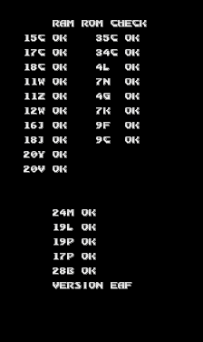

# Gaiapolis — Analogue Pocket core (openFPGA)

Gaiapolis (Konami, 1993) on Konami "pre-GX" GX123 hardware, for the Analogue
Pocket via openFPGA/opengateware.

**Status: the whole machine boots through its self-test with every item OK
and into the attract mode with music in simulation -- 40 seconds in, the
music's level is within 1 dB of MAME's recording; the Pocket build fits
the FPGA (52% logic, 66% block RAM) with timing closed at 96 MHz, CI
publishes the SD-card package, and the first run on hardware is next.**

| RTL, frame 1400 | MAME, frame 1400 | self-test |
|---|---|---|
|  |  |  |

**The reference renderer is complete and reproduces MAME's output exactly** --
full frames, not just individual layers. `tools/regress_render.sh`: 28 gates,
zero differing pixels (24 substantive; the trivial ones are labelled).

Covered: K056832 tilemaps, K053936 ROZ plane, K055673 sprites with the
per-pixel Z buffer and shadows, and the K055555 priority mixer.

RTL so far, each gated against the reference renderer with zero differing
pixels (`sim/run_tilemap.sh`, `sim/run_roz.sh`):

| block | gate | worst line | budget |
|---|---|---|---|
| `rtl/k056832_tilemap.sv` -- four tilemap layers | `sim/run_tilemap.sh` | 2,660 clocks | 6,144 |
| `rtl/k053936_roz.sv` -- rotate/zoom plane | `sim/run_roz.sh` | 2,777 clocks | 6,144 |
| `rtl/k053247_objlist.sv` -- sprite draw list | `sim/run_objlist.sh` | 4,175 per frame | ~245,000 vblank |
| `rtl/k053247_draw.sv` -- sprite rasterizer | `sim/run_sprite.sh` | 4,324 clocks | 6,144 |
| `rtl/k055555_mixer.sv` -- priority encoder + colour stage | `sim/run_frame.sh` | -- | -- |

**The complete video pipeline is done.** `sim/run_frame.sh` runs every block
together and reproduces the reference renderer's full frame exactly on all six
states; the RTL output is in `artifacts/rtl_frames/`.

The mixer is built the way the silicon works -- every input compared per
pixel -- rather than as MAME's sort-and-paint. `tools/mixer_experiment.py`
showed the two agree on every captured frame, shadows included, before that
structure was chosen.

**The full machine runs under Verilator** (`sim/run_system.sh`): 68000
(TG68K), Z80 (tv80) sound board with two K054539s and the K054321 latch,
ER5911 EEPROM, K054000 collision chip, and the video pipeline above, from
reset with the real program. The self-test passes every item -- ROMs, RAMs,
the two K054539s' chip RAM through their streaming ports, EEPROM -- and the
boot tracks MAME's frame by frame (`tools/probe_z80.lua`,
`tools/eeprom_replay.py`, `tools/probe_68k.lua`).

**Pocket port** (`target/pocket/`): `core_top.sv` is the APF glue, and
`gaia_mem.sv` puts the 20 MB image across the SDRAM and both PSRAMs
(`docs/hardware.md` section 11). The EEPROM is saved to `gaiapolis.sav`.

## What is here

| Path | What it is |
|---|---|
| `docs/hardware.md` | The board: memory map, chip set, ROM layout, measured bandwidth budget |
| `docs/prior-art.md` | What already exists in open RTL, and what does not |
| `gaiapolis.mra` | ROM description (standard MiSTer MRA) |
| `tools/mra_build.py` | Dependency-free ROM builder; CRC-checks every part, md5-checks the image |
| `tools/verify_rom.py` | Verifies a built image against slices of what MAME actually loads |
| `tools/dump_regions.lua` | MAME Lua: dumps those region slices |
| `tools/probe_sprites.lua` | MAME Lua: per-scanline sprite load measurement |
| `tools/dump_state.lua` | MAME Lua: freezes one frame (VRAM, palette, sprite RAM, ROZ, all chip registers) next to MAME's own snapshot; `FORCE_ENABLE` isolates a single layer |
| `tools/render_model.py` | Reference renderer -- the executable spec the RTL is written against |
| `tools/pngio.py` | Dependency-free PNG read/write |
| `tools/regress_render.sh` | Frozen-state gate for the model: renders every state and requires zero differing pixels |
| `sim/run_*.sh` | Frozen-state gates for each RTL block, and `run_frame.sh` for the whole pipeline, diffed against the model |
| `sim/run_system.sh` | The whole machine from reset: frames as PNG, the 68000/Z80 trace, audio as WAV; `LAT=pocket` models the Pocket memories' latencies |
| `tools/probe_*.lua` | MAME Lua oracles: device reads, the Z80's boot timeline, EEPROM pin traffic, the 68000's pacing |
| `tools/eeprom_replay.py` | Replays MAME's EEPROM pin traffic through the ER5911 model: a regression gate for the protocol |
| `tools/compare_audio.py` | Envelope comparison of the bench's WAV with MAME's recording |
| `target/pocket/` | The Pocket: `core_top.sv` (APF glue), `gaia_mem.sv` (SDRAM + PSRAM partition), the vendored controllers |
| `tools/mixer_experiment.py` | Shows a per-pixel priority encoder reproduces MAME's ordered composite on this game |
| `artifacts/rtl_frames/` | Full frames rendered by the RTL |
| `rtl/` | Core RTL |
| `artifacts/states/` | The frozen-state corpus and its matching MAME snapshots |
| `artifacts/` | Snapshots, measurements, and other generated output |

## Trying it on the Pocket

Every push to `main` compiles the core (`.github/workflows/compile.yml`) and
uploads `gaia-pocket` -- the SD-card package -- as a workflow artifact;
tagged releases publish it as `gaia-pocket-sdcard.zip`. Unzip it onto the
SD card root, build `gaiapolis.rom` as described below (or in the package's
`README.txt`) and put it in `Assets/gaia/common/`. `./build-local.sh` does
the same compile in Docker and leaves the package in `release/pocket/`.

What has not been seen on hardware yet, in the order it will be noticed:
the SDRAM/PSRAM/SRAM controllers' pin timing (the image load and the first
picture), the 8 MHz video clock pair and `video.json`'s rotation direction
(the picture should be upright with the sunset at the top), the audio
hand-off, the controls' mapping, and the EEPROM save (`gaiapolis.sav`
should appear after five seconds, and the settings survive a power cycle).

## Running the frozen-state gate

```sh
tools/regress_render.sh gaiapolis.rom
```

## Building the ROM

```sh
python3 tools/mra_build.py gaiapolis.mra /path/to/gaiapols.zip gaiapolis.rom
python3 tools/verify_rom.py gaiapolis.rom     # optional, needs artifacts/mame_regions.txt
```

The image is 20,316,288 bytes, md5 `7ed05d08287ecc2be8592b0ef0158aad`.
**No ROMs are distributed with this repository.**

## The short version of the feasibility question

* 18.9 MB of ROM against 48 MB across the Pocket's four independent memory
  buses — it fits, with a clean partition (`docs/hardware.md` §11).
* Worst measured sprite load is 348 16-bit words per 64 us scanline. Bandwidth
  is not the blocker.
* Seven of the eight custom chips already have open Verilog, and `jtrungun`
  (Run and Gun — same Konami generation, K055673 sprites + K053936 ROZ +
  2 x K054539) is a released Pocket core. The gaps are the **K055555** priority
  encoder and finishing the **K056832** tilemap generator.
* MAME itself is `MACHINE_IMPERFECT_GRAPHICS` for this driver, so the usual
  "make MAME the oracle" method needs adjusting (`docs/hardware.md` §10).

## Credits

The Gaiapolis-specific RTL, reference renderer and verification harness
(`rtl/`, `tools/`, `sim/`) are original; the rest of the core is built on
other people's work.

**Platform & toolchain**

* the **Analogue Pocket** openFPGA framework (APF) itself -- Analogue
  Enterprises Limited, `platform/pocket/bsp/pocket/apf_top.sv`,
  `platform/pocket/peripherals/io_pad_controller.sv`, and the Analogue
  copyright carried in `target/pocket/core_top.sv`
* **Marcus Andrade** ([@boogermann](https://github.com/boogermann)) /
  [OpenGateware](https://github.com/opengateware) -- the Pocket integration
  framework the rest of `platform/pocket/` (pad, audio, save/hiscore, video
  and memory glue) is built from, and the `raetro/quartus:pocket` Docker
  image `build-local.sh` and CI compile with; 41 of its 63 files carry his
  copyright. Also in the platform layer: **Alexey Melnikov (Sorgelig)** --
  audio filters, DC blocker, scanlines and shadowmask; **Till Harbaum** --
  the original scanline generator; **Adam Gastineau** -- the data loader
  and unloader; **Jim Gregory** and **Alan Steremberg** -- MAME
  hiscore.dat support; **Jacob Boline** -- USB HID keyboard translation.
* **GHDL** -- converts the vendored TG68K.C VHDL kernel to Verilog
  (`modules/cpu-tg68k/gen/`) so one source feeds both Quartus and Verilator
* **Verilator** -- every simulation bench in `sim/`

**Vendored cores** (`modules/`, see `modules/VENDOR.md`)

* **TG68K.C**, the switchable 68000/68010/68020 kernel, by Tobias Gubener
  -- `modules/cpu-tg68k`, LGPL-3.0
* **tv80**, the Z80 core, by Guy Hutchison -- `modules/cpu-tv80`, MIT,
  based on Daniel Wallner's VHDL T80 core, by way of `plasticbugs/punchout`
* the PSRAM controller, from the openFPGA SNES core, by Adam Gastineau --
  `target/pocket/psram.sv`, MIT
* the SDRAM controller's pin-level timing -- CL2, read data captured at
  READ+4, proven on the Pocket at 96 MHz -- carried over from this
  author's own S.T.U.N. Runner core, itself derived from the Punch-Out!!
  core's `sdram16.sv` (`target/pocket/sdram_ctrl.sv`)

**Reference & verification**

* **The MAME team**, the oracle throughout (`docs/hardware.md` section 10,
  `METHODOLOGY.md`). `ref/mame/mystwarr.cpp` and `mystwarr_v.cpp` (R.
  Belmont, Phil Stroffolino, Acho A. Tang, Nicola Salmoria) describe the
  board; `konamigx_v.cpp` (R. Belmont, Acho A. Tang, Phil Stroffolino,
  Olivier Galibert) is the GX-era video/mixer model this "pre-GX" driver
  shares. Kept as reference only -- none of it is compiled into the core.
* The custom-chip device models in `ref/mame/`, same terms: `k054539.cpp`
  and `k054321.cpp` (Olivier Galibert); `k054156_k054157_k056832.cpp`,
  `k053246_k053247_k055673.cpp`, `k053936.cpp` and `k055555.cpp` (David
  Haywood); `k054338.cpp` (David Haywood); `k054000.cpp` (David Haywood,
  Angelo Salese); `eepromser.cpp` (Aaron Giles).
* **jotego (Jose Tejada)**'s `jtcores` and **Furrtek**'s silicon reverse
  engineering of this Konami chip generation, plus jotego's released
  `jtrungun` (Run and Gun) core against the same chipset -- the prior-art
  survey this core is scoped against (`docs/prior-art.md`). No code from
  either is vendored here; the video pipeline ended up written directly
  from the reference renderer instead of ported (see above).

## Licence

GPL-3.0, following the GPL-3.0-or-later files in the OpenGateware platform
layer (`platform/pocket/`) and the LGPL-3.0 TG68K.C kernel
(`modules/cpu-tg68k/`). No jtcores RTL is vendored in this repository --
jotego's `jtcores` and Furrtek's silicon reverse engineering informed the
prior-art survey and hardware research (`docs/prior-art.md`) but
contributed no code.
